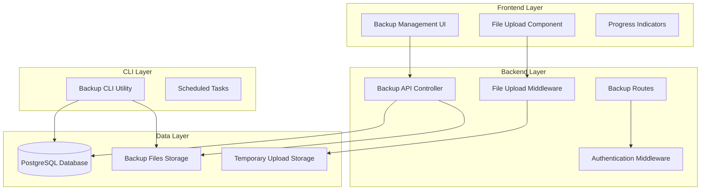

# Backup & Restore System Design

## Overview

The Backup & Restore System provides comprehensive data migration capabilities for the OWU Palace HRMS project. The system consists of backend APIs for data export/import, a web-based management interface, and CLI tools for automation. The design emphasizes data integrity, security, and user experience while supporting both manual operations and automated workflows.

## Architecture

### High-Level Architecture



### System Components

1. **Backend API Layer**
   - RESTful endpoints for backup operations
   - File upload handling with validation
   - Authentication and authorization
   - Database transaction management

2. **Frontend Interface**
   - React-based management dashboard
   - File upload with drag-and-drop support
   - Real-time progress tracking
   - Responsive design for all devices

3. **CLI Utilities**
   - Standalone backup creation scripts
   - Integration with system schedulers
   - Detailed logging and error reporting

4. **Storage Management**
   - Local file system storage for backups
   - Temporary storage for uploads
   - Automatic cleanup mechanisms

## Components and Interfaces

### Backend Components

#### BackupController
```typescript
interface BackupController {
  createBackup(req: AuthRequest, res: Response): Promise<void>
  downloadBackup(req: AuthRequest, res: Response): Promise<void>
  restoreBackup(req: AuthRequest, res: Response): Promise<void>
  listBackups(req: AuthRequest, res: Response): Promise<void>
  deleteBackup(req: AuthRequest, res: Response): Promise<void>
}
```

**Responsibilities:**
- Orchestrate backup creation process
- Handle file downloads and uploads
- Manage restore operations with transactions
- Provide backup file management

#### BackupService
```typescript
interface BackupService {
  exportAllData(): Promise<BackupData>
  createBackupFile(data: BackupData): Promise<BackupFile>
  validateBackupFile(file: File): Promise<boolean>
  importBackupData(data: BackupData): Promise<void>
  cleanupTempFiles(): Promise<void>
}
```

**Responsibilities:**
- Database data extraction
- File compression and decompression
- Data validation and integrity checks
- Cleanup operations

#### FileManager
```typescript
interface FileManager {
  saveBackup(data: Buffer, filename: string): Promise<string>
  loadBackup(filename: string): Promise<Buffer>
  listBackupFiles(): Promise<BackupFileInfo[]>
  deleteBackupFile(filename: string): Promise<void>
  ensureDirectories(): Promise<void>
}
```

**Responsibilities:**
- File system operations
- Directory management
- File metadata extraction

### Frontend Components

#### BackupManagement Component
```typescript
interface BackupManagementProps {
  // Main backup management interface
}

interface BackupManagementState {
  backups: BackupFile[]
  loading: boolean
  creating: boolean
  restoring: boolean
  selectedFile: File | null
  showModals: {
    restore: boolean
    delete: boolean
  }
}
```

**Features:**
- Backup creation with progress tracking
- File upload for restore operations
- Backup file listing and management
- Modal dialogs for confirmations

#### FileUpload Component
```typescript
interface FileUploadProps {
  onFileSelect: (file: File) => void
  acceptedTypes: string[]
  maxSize: number
  dragAndDrop: boolean
}
```

**Features:**
- Drag-and-drop file selection
- File type and size validation
- Progress indicators for uploads
- Error handling and user feedback

### CLI Components

#### BackupUtility
```typescript
interface BackupUtility {
  createBackup(): Promise<BackupResult>
  validateEnvironment(): Promise<boolean>
  logProgress(message: string): void
  handleErrors(error: Error): void
}
```

**Features:**
- Standalone backup creation
- Environment validation
- Detailed logging
- Error handling and reporting

## Data Models

### BackupData Structure
```typescript
interface BackupData {
  metadata: {
    version: string
    timestamp: string
    databaseUrl: string // masked for security
    totalRecords: number
    backupId: string
    createdBy: string
  }
  data: {
    admins: Admin[]
    staff: Staff[]
    categories: Category[]
    salaryStructures: SalaryStructure[]
    loans: Loan[]
    issues: Issue[]
    files: File[]
    shareableLinks: ShareableLink[]
  }
}
```

### BackupFile Information
```typescript
interface BackupFileInfo {
  fileName: string
  size: number
  createdAt: Date
  modifiedAt: Date
  downloadUrl: string
  metadata?: BackupMetadata
}
```

### API Response Formats
```typescript
interface BackupResponse {
  success: boolean
  data?: {
    backupId: string
    fileName: string
    filePath: string
    timestamp: string
    totalRecords: number
    size: number
    downloadUrl: string
  }
  error?: {
    code: string
    message: string
    details?: string
  }
  timestamp: string
}
```

## Error Handling

### Error Categories

1. **Validation Errors**
   - Invalid file formats
   - Corrupted backup files
   - Missing required data

2. **Permission Errors**
   - Insufficient user privileges
   - File system access denied
   - Database connection failures

3. **System Errors**
   - Disk space limitations
   - Network timeouts
   - Database transaction failures

4. **Business Logic Errors**
   - Data integrity violations
   - Concurrent operation conflicts
   - Version compatibility issues

### Error Response Strategy

```typescript
interface ErrorResponse {
  success: false
  error: {
    code: string // Machine-readable error code
    message: string // User-friendly message
    details?: string // Technical details for debugging
    timestamp: string
  }
}
```

### Recovery Mechanisms

1. **Automatic Cleanup**
   - Remove temporary files on failure
   - Rollback database transactions
   - Reset operation states

2. **User Guidance**
   - Clear error messages
   - Suggested remediation steps
   - Contact information for support

3. **System Stability**
   - Graceful degradation
   - Prevent cascade failures
   - Maintain service availability

## Testing Strategy

### Unit Testing

1. **Backend Controllers**
   - Test all API endpoints
   - Mock database operations
   - Validate error handling
   - Test permission checks

2. **Service Layer**
   - Test data export/import logic
   - Validate file operations
   - Test compression/decompression
   - Mock external dependencies

3. **Frontend Components**
   - Test user interactions
   - Validate state management
   - Test file upload functionality
   - Mock API responses

### Integration Testing

1. **End-to-End Workflows**
   - Complete backup creation process
   - Full restore operation testing
   - File upload and download flows
   - Error scenario handling

2. **Database Integration**
   - Test with real database connections
   - Validate transaction handling
   - Test data integrity preservation
   - Performance testing with large datasets

3. **File System Integration**
   - Test file creation and deletion
   - Validate directory management
   - Test permission handling
   - Storage capacity testing

### Performance Testing

1. **Load Testing**
   - Large dataset backup creation
   - Multiple concurrent operations
   - File upload performance
   - Database query optimization

2. **Stress Testing**
   - Memory usage under load
   - Disk space limitations
   - Network timeout scenarios
   - Recovery from failures

### Security Testing

1. **Authentication Testing**
   - Permission validation
   - Session management
   - Token expiration handling

2. **File Security**
   - Upload validation
   - Path traversal prevention
   - File type verification
   - Size limit enforcement

3. **Data Protection**
   - Sensitive data masking
   - Backup file encryption
   - Access logging
   - Audit trail validation

## Security Considerations

### Access Control
- SUPER_ADMIN role requirement for all operations
- JWT token validation for API access
- Session timeout handling
- Audit logging for all operations

### Data Protection
- Database connection string masking
- Secure file storage with appropriate permissions
- Temporary file cleanup
- Backup file integrity verification

### File Upload Security
- File type validation (JSON/ZIP only)
- File size limits (100MB maximum)
- Virus scanning integration points
- Path traversal prevention

### Network Security
- HTTPS enforcement for file transfers
- Request rate limiting
- CORS configuration
- Input sanitization

## Performance Optimization

### Database Operations
- Use streaming for large datasets
- Implement batch processing
- Optimize query performance
- Connection pooling

### File Operations
- ZIP compression for storage efficiency
- Streaming file uploads/downloads
- Temporary file management
- Disk space monitoring

### Memory Management
- Avoid loading entire datasets in memory
- Use streaming operations
- Implement garbage collection
- Monitor memory usage

### Caching Strategy
- Cache backup file listings
- Implement metadata caching
- Use CDN for file downloads
- Cache validation results

## Deployment Considerations

### Environment Setup
- Create backup storage directories
- Set appropriate file permissions
- Configure environment variables
- Install required dependencies

### Monitoring
- File system usage monitoring
- Backup operation logging
- Performance metrics collection
- Error rate tracking

### Maintenance
- Automated backup cleanup
- Log rotation policies
- Performance optimization
- Security updates

### Scalability
- Horizontal scaling considerations
- Load balancing for file operations
- Database connection management
- Storage capacity planning