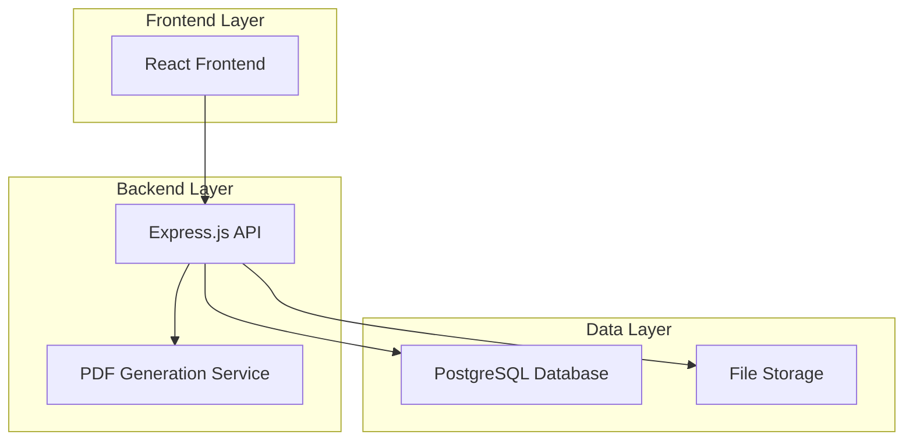

# Design Document

## Overview

The Owu Palace Staff HRMS is a single-page application (SPA) built with React.js and Node.js/Express.js, designed with a mobile-first approach and minimalist aesthetic. The system follows a three-tier architecture with a React frontend, RESTful API backend, and PostgreSQL database, emphasizing security, performance, and user experience.

## Architecture

### High-Level Architecture



### Technology Stack

**Frontend:**
- React.js 18+ with functional components and hooks
- Tailwind CSS for styling and responsive design
- React Router for client-side routing
- Axios for API communication
- React Hook Form for form management
- Chart.js/Recharts for data visualizations

**Backend:**
- Node.js with Express.js framework
- JWT for authentication and session management
- Multer for file upload handling
- pdf-lib for PDF generation
- bcrypt for password hashing
- Helmet for security headers

**Database:**
- PostgreSQL 14+ as primary database
- Prisma ORM for database operations and migrations

**Infrastructure:**
- Docker for containerization
- Cloud storage (AWS S3/Google Cloud Storage) for file storage
- Environment-based configuration

## Components and Interfaces

### Frontend Components

#### Core Layout Components
- **AppLayout**: Main application wrapper with navigation
- **Sidebar**: Collapsible navigation menu
- **Header**: Top bar with user info and notifications
- **Dashboard**: Landing page with metrics and quick actions

#### Feature Components
- **StaffProfile**: Staff creation and editing forms
- **StaffList**: Searchable and filterable staff directory
- **PayrollManager**: Salary structure and payroll generation
- **LoanManager**: Loan registration and tracking
- **Organogram**: Interactive organizational chart
- **IssueTracker**: Issue logging and management
- **ReportGenerator**: Report creation and export

#### Shared Components
- **DataTable**: Reusable table with sorting and pagination
- **Modal**: Reusable modal dialogs
- **FileUpload**: Document upload component
- **FormField**: Standardized form input components
- **LoadingSpinner**: Loading state indicator
- **NotificationToast**: Success/error notifications

### Backend API Endpoints

#### Authentication
- `POST /api/auth/login` - Admin login
- `POST /api/auth/logout` - Admin logout
- `GET /api/auth/verify` - Verify JWT token

#### Staff Management
- `GET /api/staff` - Get all staff with filtering/pagination
- `POST /api/staff` - Create new staff member
- `GET /api/staff/:id` - Get specific staff member
- `PUT /api/staff/:id` - Update staff member
- `DELETE /api/staff/:id` - Delete staff member
- `GET /api/staff/:id/audit` - Get audit trail for staff member

#### Payroll Management
- `GET /api/payroll/structures` - Get salary structures
- `POST /api/payroll/structures` - Create salary structure
- `PUT /api/payroll/structures/:id` - Update salary structure
- `POST /api/payroll/generate` - Generate monthly payroll
- `GET /api/payroll/schedule/:month/:year` - Get payroll schedule
- `POST /api/payroll/external-payment` - Upload external payment confirmation

#### Loan Management
- `GET /api/loans` - Get all loans with filtering
- `POST /api/loans` - Create new loan
- `PUT /api/loans/:id` - Update loan status
- `GET /api/loans/:id/ledger` - Get loan repayment history
- `POST /api/loans/:id/repayment` - Process loan repayment

#### Organizational Chart
- `GET /api/organogram` - Get organizational structure
- `GET /api/organogram/export` - Export organogram as PDF/image

#### Issues Management
- `GET /api/issues` - Get all issues with filtering
- `POST /api/issues` - Create new issue
- `PUT /api/issues/:id` - Update issue
- `POST /api/issues/:id/comments` - Add comment to issue

#### Reports
- `GET /api/reports/headcount` - Generate headcount report
- `GET /api/reports/salary` - Generate salary report
- `GET /api/reports/loans` - Generate loan summary report
- `POST /api/reports/export` - Export report to Excel/CSV

#### File Management
- `POST /api/files/upload` - Upload documents
- `GET /api/files/:id` - Download file
- `DELETE /api/files/:id` - Delete file

## Data Models

### Staff Model
```typescript
interface Staff {
  id: string;
  employeeId: string;
  
  // Personal Information
  fullName: string;
  dateOfBirth: Date;
  gender: 'Male' | 'Female' | 'Other';
  maritalStatus: 'Single' | 'Married' | 'Divorced' | 'Widowed';
  nationality: string;
  photo?: string;
  
  // Contact Information
  address: string;
  personalEmail: string;
  workEmail: string;
  phoneNumbers: string[];
  
  // Job Information
  jobTitle: string;
  department: string;
  reportingManagerId?: string;
  dateOfJoining: Date;
  employmentType: 'Full-time' | 'Part-time' | 'Contract';
  workLocation: string;
  
  // Emergency Contact
  emergencyContact: {
    name: string;
    relationship: string;
    phoneNumber: string;
  };
  
  // System fields
  isExternallyPaid: boolean;
  isActive: boolean;
  createdAt: Date;
  updatedAt: Date;
}
```

### Salary Structure Model
```typescript
interface SalaryStructure {
  id: string;
  staffId: string;
  basicSalary: number;
  allowances: {
    housing: number;
    transport: number;
    medical: number;
    other: { name: string; amount: number }[];
  };
  deductions: {
    tax: number;
    pension: number;
    loan: number;
    other: { name: string; amount: number }[];
  };
  effectiveDate: Date;
  createdAt: Date;
  updatedAt: Date;
}
```

### Loan Model
```typescript
interface Loan {
  id: string;
  staffId: string;
  amount: number;
  reason: string;
  interestRate: number;
  repaymentTerms: number; // months
  monthlyDeduction: number;
  status: 'Pending' | 'Approved' | 'Rejected' | 'Completed';
  approvedDate?: Date;
  startDate?: Date;
  outstandingBalance: number;
  installmentsPaid: number;
  createdAt: Date;
  updatedAt: Date;
}
```

### Issue Model
```typescript
interface Issue {
  id: string;
  ticketNumber: string;
  staffId?: string;
  category: 'Workplace Conflict' | 'Payroll Discrepancy' | 'Policy Violation' | 'Other';
  title: string;
  description: string;
  status: 'Open' | 'In Progress' | 'Resolved' | 'Closed';
  priority: 'Low' | 'Medium' | 'High' | 'Critical';
  assignedTo: string; // Admin ID
  comments: IssueComment[];
  createdAt: Date;
  updatedAt: Date;
}
```

### Audit Trail Model
```typescript
interface AuditTrail {
  id: string;
  entityType: 'Staff' | 'Salary' | 'Loan' | 'Issue';
  entityId: string;
  action: 'CREATE' | 'UPDATE' | 'DELETE';
  changes: Record<string, { old: any; new: any }>;
  performedBy: string; // Admin ID
  timestamp: Date;
}
```

## Error Handling

### Frontend Error Handling
- Global error boundary to catch React component errors
- API error interceptors with user-friendly messages
- Form validation with real-time feedback
- Network error handling with retry mechanisms
- Loading states and error states for all async operations

### Backend Error Handling
- Centralized error handling middleware
- Structured error responses with consistent format
- Input validation using Joi or similar library
- Database error handling with appropriate HTTP status codes
- Logging system for error tracking and debugging

### Error Response Format
```typescript
interface ErrorResponse {
  success: false;
  error: {
    code: string;
    message: string;
    details?: any;
  };
  timestamp: string;
}
```

## Testing Strategy

### Frontend Testing
- **Unit Tests**: Jest and React Testing Library for component testing
- **Integration Tests**: Testing component interactions and API calls
- **E2E Tests**: Cypress for critical user flows
- **Accessibility Tests**: axe-core for accessibility compliance

### Backend Testing
- **Unit Tests**: Jest for individual function testing
- **Integration Tests**: Supertest for API endpoint testing
- **Database Tests**: Test database operations with test database
- **Security Tests**: Testing authentication and authorization

### Test Coverage Goals
- Minimum 80% code coverage for critical business logic
- 100% coverage for authentication and security functions
- All API endpoints must have integration tests
- Critical user flows must have E2E tests

### Testing Environment
- Separate test database with seed data
- Mock external services (file storage, email)
- Automated testing in CI/CD pipeline
- Performance testing for database queries and API responses

## Security Considerations

### Authentication & Authorization
- JWT-based authentication with secure token storage
- Password hashing using bcrypt with salt rounds
- Session timeout and token refresh mechanisms
- Role-based access control (single admin role initially)

### Data Protection
- Input sanitization and validation
- SQL injection prevention through parameterized queries
- XSS protection with Content Security Policy
- HTTPS enforcement for all communications
- File upload validation and virus scanning

### Infrastructure Security
- Environment variable management for secrets
- Database connection encryption
- Regular security updates and dependency scanning
- Backup encryption and secure storage
- Rate limiting for API endpoints

## Performance Optimization

### Frontend Performance
- Code splitting and lazy loading for routes
- Image optimization and lazy loading
- Memoization for expensive calculations
- Virtual scrolling for large data sets
- Caching strategies for API responses

### Backend Performance
- Database indexing for frequently queried fields
- Connection pooling for database connections
- Caching layer (Redis) for frequently accessed data
- Pagination for large data sets
- Optimized database queries with proper joins

### Monitoring and Analytics
- Performance monitoring with metrics collection
- Database query performance tracking
- Error tracking and alerting
- User activity analytics
- System health monitoring